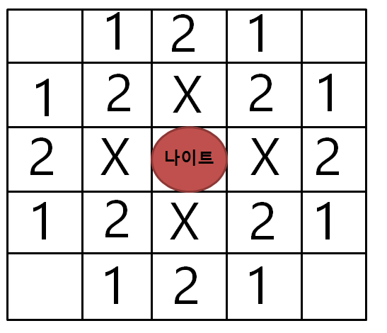
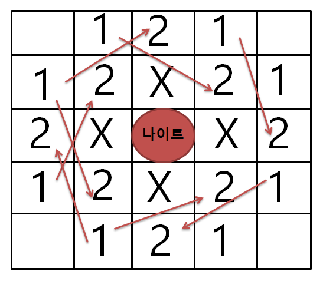

# minimum-knight-moves

## 문제 설명

infinity에서 +infinity까지의 좌표가 있는 무한 체스판이 있고, 체스판 [0, 0] 좌표에 나이트가 있다.
나이트는 아래와 같이 8가지 동작을 할 수 있다. 이동은 기본 방향으로 두 칸, 직각 방향으로 한 칸이다
매개변수로 x,y 좌표가 주어질 때, 나이트를 [x, y]으로 이동하는 데 필요한 최소 스텝 수를 반환한다. 이때, 답이 존재한다는 것은 확실하다.


## Example

```
#1
Input: x = 2, y = 1
Output: 1
Explanation: [0, 0] → [2, 1]
```

```
#2
Input: x = 5, y = 5
Output: 4
Explanation: [0, 0] → [2, 1] → [4, 2] → [3, 4] → [5, 5]
```

## 문제 풀이

해당문제는 BFS로도 DFS로도 풀 수 있다.

### BFS 풀이

1. (0,0)지점으로 부터 한 스텝 만에 갈 수 있는 모든 지점 탐색.
2. 해당 지점에서 또 한 스텝 만에 갈 수 있는 모든 지점 탐색
3. 위와 같은 방법을 반복 사용하여 원을 그리 듯 (0,0)에서부터 전체 탐색을 해나간다.
4. 그러던 중 타겟 x,y값을 만나게 되면 정지하고 총 스텝을 리턴한다.
5. 위 로직이 가능한 이유는 답이 존재한다는 것이 확실하기 때문이다.

### DFS 풀이

dfs를 사용하기전에 몇가지 전제 조건을 이해하여야 한다. 첫 번째는 나이트의 좌표에 절대 값을 씌었을 때 해당 좌표부터 원점까지의 최소 스텝과 원래 좌표부터 원점까지의 최소 스텝이 같다는 것이다. 두 번째는
나이트가 인근의 좌표에 가기위해서 각 몇번의 최소이동이 필요한지 아는 것인데 아래그림을 참고하면

- |X| + |Y| = 1 -> 갈 수 없다.
- |X| + |Y| = 2 -> 2번의 스텝으로 갈 수 있다.
- |X| + |Y| = 3 -> 1번의 스텝으로 갈 수 있다.

위와 같은 결과를 도출 할 수 있다.




실제 풀이 로직은

1. 각 좌표에 절대 값을 씌어 1사분분면의 좌표에서 (0,0)까지의 최소 스텝을 구한다.
2. 최소 스텝을 구하고 있음으로 x와 y는 -방향으로만 움직인다.
3. 갈 수 있는 방향은 (-1,-2), (-2,-1) 다 방향 뿐이다.
4. 타겟 지점에서 (0,0)으로 오다보면 결국엔 |X|+|Y| <=3 인 지점안으로 들어 올 수 밖에 없다. 이때의 절대 값을 따라 해당 지점에서 (0,0)점까지의 최소스텝을 리턴한다. (무조건 성립한다는 전제가 있으니 |X|+|Y|=1 지점 무시, |X|+|Y|=3의 경우 바로 다음이 |X|+|Y|=0이므로 해당 좌표로 판별)
5. 즉, |X|+|Y| = 0 인 지점과 |X|+|Y|=2 인 지점에서 각 return 0, return 2를 해준다.
6. 이때 각 지점에서 memo사용해서 검색 횟수 줄인다.

### 풀이 코드

```java
class Solution {
    private Map<String, Integer> memo = new HashMap<>();

    private int dfs(int x, int y) {
        String key = x + "," + y;
        if (memo.containsKey(key)) {
            return memo.get(key);
        }

        if (x + y == 0) {
            return 0;
        } else if (x + y == 2) {
            return 2;
        } else {
            Integer ret = Math.min(dfs(Math.abs(x - 1), Math.abs(y - 2)),
                    dfs(Math.abs(x - 2), Math.abs(y - 1))) + 1;
            memo.put(key, ret
            return ret;
        }
    }

    public int minKnightMoves(int x, int y) {
        return dfs(Math.abs(x), Math.abs(y));
    }
}
```
