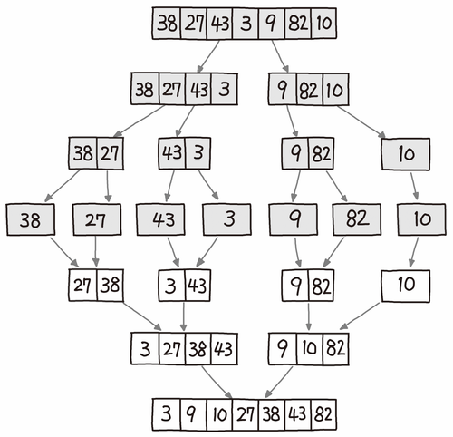
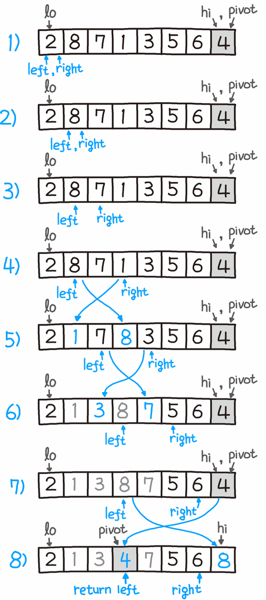

## 정렬

정렬알고리즘은 목록의 요소를 특정 순서대로 넣는 알고리즘이다. 대개 숫자식 순서(NumricalOrder)와 사전식 순서(Lexicaographical Order)로 정렬한다.

### 버블 정렬

- 효율적이지 못한 알고리즘
- 배열 전체를 살펴서 연달아 있는 아이템 2개의 순서가 잘못되어 있으면 바꾼다.
- 시간복잡도 항상O(n^2)

```jsx
//수도 코드
BoobleSort(A)
	for i from 1 to A.length
		for j from 0 to A.length -1
			if A[j] > A[j+1]
				swap A[j] with A[j+1]
```

### 병합정렬(Marge Sort)

- 분할정복(Divide and Conquer) 알고리즘
  - 분할정복이란 : 주어진 문제를 여러 sub 문제들로 나눈 다음 그 문제들을 해결 한 후 합쳐서 답을 내는 것
- 최선과 최악 O(nlogn) 의 시간복잡도를 가진다
- 대부분 퀵 정렬보다는 느리지만 일정한 실행속도와 안정정렬(Stable Sort)라는 점에서 많이 쓰인다.

  
출처: 파이썬 알고리즘 인터뷰(책만)

### 퀵정렬(Quick Sort)

- 피벗을 기준으로 좌우를 나누는 특징으로 파티션 교환 정렬이라고도 불린다.
- 분할 정복 알고리즘이다
- 매우 빠르며 굉장히 효율적이지만 O(nlogn), 최악의 경우(=이미 정렬된 배열이 입력값으로 들어왔을 경우 ) O(n^2)의 시간복잡도를 갖는다.
- 대부분 병합정렬보다 빠르지만 입력값에 따라 성능차이가 큰편, 개선하는 연구 결과도 많이 나옴
- 피벗이란 개념을 통해 피벗보다 작으면 왼쪽, 크면 오른쪽 같은 방식으로 파티셔닝 하면서 쪼개 나간다.

```jsx
//수도코드, 로무토 파티션 계획: 항상 맨 오른쪽의 피벗을 택하는 단순한 방식
QuickSort(A, lo, hi)
	if lo < hi then
		pivot := partition(A, lo, hi)
		QuickSort(A, lo, pivot - 1)
		QuickSort(A, pivot + 1, hi)
```

- 위 수도코드는 퀵정렬의 메인함수이다. 파티션을 나누고 각각 재귀 호출하는 전형적인 분할정복 구조이다.

```jsx
//수도코드, 로무토 파티션 계획: 항상 맨 오른쪽의 피벗을 택하는 단순한 방식
partition(A, lo, hi)
	pivot := A[hi]
	i := lo
	for j := lo to hi do
		if A[j] < pivot then
			swap A[i] with A[j]
			i := i+1
	swap A[i] with A[hi]
	return i
```

- 피벗은 맨 오른쪽 값을 기준으로 한다. 2개의 포인터가 이동해서 오른쪽 포인터의 값이 피벗보다 작다면 서로 스왑한다.
- 마지막에 왼쪽 포인터 위치로 피벗이 이동하면서 피봇의 값 왼쪽에는 작은값 큰쪽에는 큰값이 모여있게 된다.
- 위와 같은 방법으로 분할하며 정복을 진행하여 lo > hi 가 될 떄 까지 재귀로 반복하면 정렬이 완료 된다.

  
출처: 파이썬 알고리즘 인터뷰(책만)

### 안정 정렬 vs 불안정 정렬

안정정렬 : 중복된 값을 입력 순서와 동일하게 정렬한다.

- 기존의 정렬했던 순서는 다른 기준으로 재정렬하더라도 기준순서가 유지된 상태에서 정렬이 이루어지는 것
- 불안정 정렬은 재정렬하면 기존의 정렬 순서는 무시된 채 뒤섞임
- 병합정렬, 버블정렬은 안정정렬 , 퀵정렬은 불안정 정렬이다.

### 팀소트(TIm Sort)

- ‘실제 데이터는 대부분 이미 정렬되어 있을 것이다’ 라고 가정하고 실제 데이터에서 고성능을 낼 수 있도록 설계한 알고리즘
- 병합정렬과 삽입정렬을 휴리스틱하게 조합한 알고리즘
- 최선 시간복잡도 O(n) 평균,최악 시간복잡도 O(nlogn)
- 이론적으로 어떠한 정렬 알고리즘도 한번이상 비교하게 되면 O(nlogn) 보다 빨라질 수 없지만 팀소트는 이미 정렬 되어 있는 경우 비교를 건너뛰기 때문이 O(n)까지 가능하다
- 현업에서 가장 널리쓰이는 알고리즘

## 이진 검색(Binary Seasrch)

- 정렬된 배열에서 타겟을 찾아내는 검색 알고리즘
- 값을 찾아내는 시간 복잡도 O(logn)
- BST → 저장된 구조를 저장하고 탐색하는 **자료구조** BS → 정렬된 배열에서 값을 찾아내는 **알고리즘**
- 중간값부터 탐색 시작 크다면 왼쪽포인터 오른쪽으로 이동 작다면 오른쪽포인트를 왼쪽으로 이동 다시 양쪽 포인트의 중간값 탐색

## 투 포인터 & 슬라이딩 윈도우

### 투포인터

- 대개는 시작점과 끝점 또는 왼쪽 포인터와 오른쪽 포인터 두 지점을 기준으로 하는 문제 풀이 전략을 뜻한다. 범위를 좁혀 나가기 위해서는 일반적으로 배열이 정렬되어 있을 때 좀 더 유리하다.
- 책에 등장하는 내용이 아닌 알고리즘 풀이와 관련한 실전적인 풀이 기법

### 슬라이딩 윈도우

- 고정사이즈의 윈도우가 이동하면서 윈도우 내에 있는 데이터를 이용해 문제를 풀이하는 알고리즘
- 2개의 네트워크 호스트간의 패킷 흐름을 제어하기 위한 방법을 지칭하는 네트워크 용어
- 투포인터가 주로 정렬된 배열을 대상으로 한다면 슬라이딩 윈도우는 정렬 여부에 관계없이 활용된다.
- 투포인터 : 정렬 대부분 o , 윈도우 사이즈 가변, 이동 좌우 포인터 양방향
  슬라이딩 윈도우 : 정렬 여부 관련 x, 윈도우 사이즈 불변, 이동 : 좌 또는 우 방향

## 그리디 알고리즘(Greedy Algorithm)

- 글로벌 최적을 찾기 위해 각 단계에서 로컬 최적의 선택을 하는 휴리스틱 문제 해결 알고리즘 이다.
- 알고리즘 최적화 문제를 대상으로 한다.
- 최적해를 찾을 수 있으면 그것을 목표로 삼고 찾기 어렵다면 주어진 시간내에 그런대로 괜찮은 해를 찾느 것을 목표로 삼는다.
- 그리디 알고리즘이 잘 작동한는 문제들은 아래와 같은 특징을 가진다.
  - 탐욕선택속성(Greedy Choice Property) : 앞의 선택이 이후 선택에 영향을 주지 않는다.
  - 최적부분구조(Optimal Subtructure): 최적 해결 방법이 부분 문제에 대한 최적 해결 방법으로 구성되는 경우
- 다익스트라 알고리즘, 허프만 코딩 알고리즘(허프만 트리 빌드시), 머신러닝 빌드시 의사결정 트리 알고리즘(ID3) 등 에 활용된다
- DP 와 그리디 둘다 최적 부분 구조 문제를 푼다는 점에서 공통점이 있다. 차이는 아래와 같다
- DP : 하위 문제에 대한 최적의 솔루션 찾은 다음 이 결과들을 결합한 정보에 입각해 전역 최적 솔루션에 대한 선택을 한다.
- 그리디알고리즘 : 각 단계마다 로컬 최적해를 찾는 문제로 접근해 문제를 더 작게 줄여 나간다.

## 분할정복

다중 분기 재귀를 기반으로 하는 알고리즘 디자인 패러다임을 말한다

- 직접 해결할 수 있을 정도로 간단한 문제가 될때까지 문제를 재귀적으로 쪼개나간 다음 그 하위 문제의 결과들을 조합하여 원래 문제의 결과로 만들어 낸다.
- 재귀를 활용하는 대표적인 알고리즘
- 대표 : 병합정렬

```jsx
// 수도코드
funtion F(x)
	if F(x) 작은 단위 then:
		--- 정복

 else:
		x를 x1 , x2로 분할
		F(x1)과 F(x2)를 호출
		return F(x1) + F(x2) 로 F(x)를 구한 값
			-- 조합 , 분할
```

- 분할 : 문제를 동일한 유형의 여러 하위 문제로 나눈다
- 정복 : 가장 작은 단위의 하위 문제를 해결하여 정복한다
- 조합 : 하위 문제에 대한결과를 원래 문제에 대한 결과로 조합한다.

## 다이나믹 프로그래밍 알고리즘

- 정의 : 문제를 각각의 작은 문제로 나누어 해결한 결과를 저장해뒀다가 나중에 큰 문제의 결과와 합하여 풀이하는 알고라즘이다.
- 다이나믹 프로그래밍 알고리즘을 이용하면, 최적 부분 구조 를 갖고 있는 문제를 풀이 할 수 있다.
  - 최적부분 구조 : 문제의 최적 해결 방법이 부분 문제에 대한 최적 해결 방법으로 구성되는 문제
- 그리디 알고리즘은 항 상 그순간에 최적이라고 생각되는 것들을 선택하면서 풀이해 나가는 것 , 다이나믹 프로그래밍은 중복된 하위문제들의 결과를 저장해놨다가 풀이해나간다는 차이가 있다.

다이나믹 프로그래밍 ⇒ 최적 부분 구조 , 중복된 하위 문제들
그리디 알고리즘 ⇒ 최적 부분 구조 탐욕선택속성
분할정복 ⇒ 최적부분 구조

### 다이나믹 프로그래밍 방법론

- 하향식접근법 : 메모이제이션; 하위문제에 대한 정답을 계산했는지 확인해가며 문제를 자연스러운 방식으로 풀어 나간다.
- 상향식 접근법 : 타뷸레이션 , 작은 하위문제부터 살펴본 다음 큰 문제의 정답을 풀어나간다.

## Reference

파이썬 알고리즘 인터뷰(책만)
