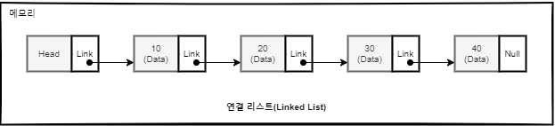
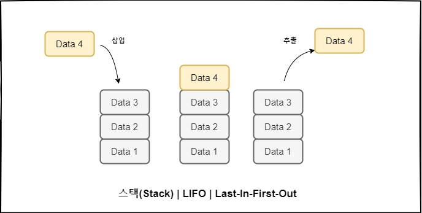
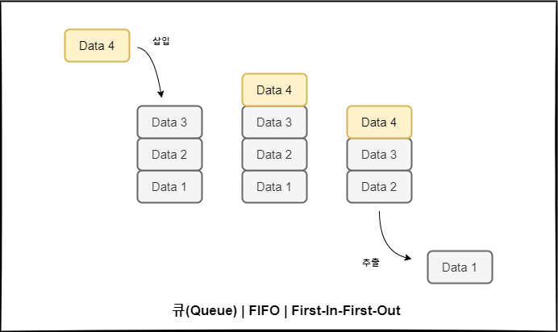
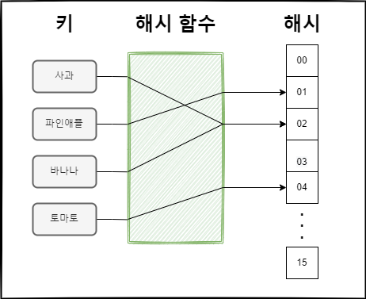
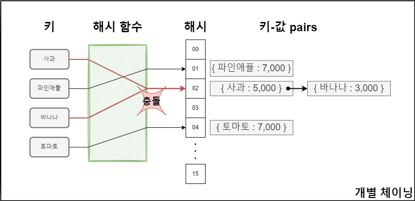
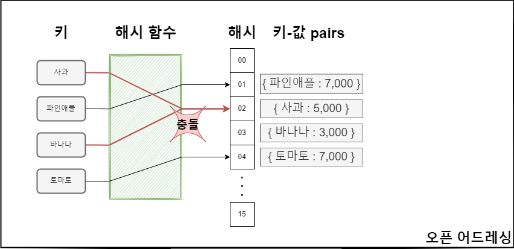

데이터 요소가 순차적(Sequential)으로 배열되는 자료구조를 선형 자료구조라고 한다. 한 번에 탐색이 가능하며, 구현하기도 쉽다.

## 1. 배열 vs 연결리스트

자료구조는 크게 메모리 공간 기반의 연속(Contiguous)방식과 포인터기반의 연결(Link)방식으로 나뉜다.
연속방식의 가장 기본이 되는 자료형은 '배열'이고, 연결방식의 가장 기본이 되는 자료형은 '연결 리스트'이다.

### 배열

- 값 또는 변수 엘리먼트의 집합으로 구성된 구조이다.
- 크기를 지정하고 해당크기만큼의 연속된 공간을 할당 받는 작업을 수행한다.
- 한번 생성한 배열은 크기를 변경하는 것이 불가능하다.
- 하나 이상의 인덱스 또는 키로 식별된다.
- 검색이 O(1)만에 이루어진다.

일반적인 배열은 위와같은 특징을 가지고 있다. 메모리가 고정되어 있다. 그러나
실제 데이터는 전체 크기를 가늠하기 힘들때가 많다. 이 문제를 해결하고자 크기를 지정하지 않고 자동으로
리사이징하는 배열인 동적 배열이 등장했다.

대부분의 프로그래밍 언어는 동적 배열을 지원하며, 자바에서는 ArrayList가 동적 배열 자료 형이다.
대부분의 동적프로그래밍 언어 들은 아예 정적 배열 자체가 없다. 파이썬의 경우도 동적배열인 리스트만 제공한다.

동적배열의 원리는 미리 초기 값을 작게 잡아 배열을 생성하고 배열이 꽉 채워지면 메모리에 더 큰 배열을 할당하고 기존 데이터를 복사하는 방법이다. 이 과정을 더블링 이라고 하여 2배씩 늘려주는데 당연히 이 비율은 언어마다 상이하다.

### 연결 리스트

연결 리스트(Linked List)는 데이터의 순서가 메모리에 물리적인 순서대로 저장되지 않는다. 그러기에 동적으로 새로운 노드를 삽입하거나 삭제하기가 쉽다 그러나 배열과 달리 특정인덱스에 접근하기 위해서는 전체를 순서대로 읽어야하므로 O(n)의 시간이 소요된다. 그러나 시작 또는 끝지점에 아이템을 추가하거나 삭제하는 작업은 O(1)에 가능하다.

## 2. 스택 vs 큐

- 스택 : LIFO(Last In First Out) 후입선출

- 큐 : FIFO (First IN First Out) 선입선출

## 3. 해시테이블

해시테이블 또는 해시 맵은 키를 값에 매핑 할 수 있는 자료구조 이다.  
대부분의 연산의 시간복잡도가 O(1)이라는 특징을 가지고 있다.

### 해시란?

해시함수란 임의크기의 데이터를 고정 크기 값으로 매핑하는 게 사용할수있는 함수를 말한다

- ABC -> A1, 1324BC -> CB , AF32B -> D5 이처럼 각기 다른 글자가 화살표를 통과하면 2바이트의 고정 크기 값으로 매핑된다. 이 화살표 역할을 하는것이 **해시함수**이다.
- 해시테이블을 인덱싱하는 하기위해 해시함수 사용하는 것을 해싱이라고한다.
- 해싱은 정보를 가능한 빠르게 저장하고 검색하기위해 사용하는 중요한 기법이다.
- 최적의 검색이 필요한 분야에 사용된다.

### 로드팩터

- 해시테이블에 저장된 데이터 개수 n을 버킷의 갯수 k로 나눈값으로
- 비율에따라 해시함수를 재작성해야될지나 해시테이블 크기를 조정할지를 결정한다.
- 자바 10의 경우 0.75이 넘어가면 해시테이블 공간 재할당한다.

### 충돌

아무리 좋은 해시함수라도 충돌은 발생한다. 충돌이 발생할 시 해결법은 2가지가 있다.

- 개별체이닝 : 충돌발생시 연결리스트로 연결하는 방식 (자바,c,go )
- 오픈어드레싱 : 충돌발생시 탐사를 통해 빈공간 찾아나서는 방식, 모든 원소가 반드시 자신의 해시값과 일치하는 주소에 저장된다는 보장은 없다. (루비,파이썬)

## Reference

파이썬 알고리즘 인터뷰(책만)
