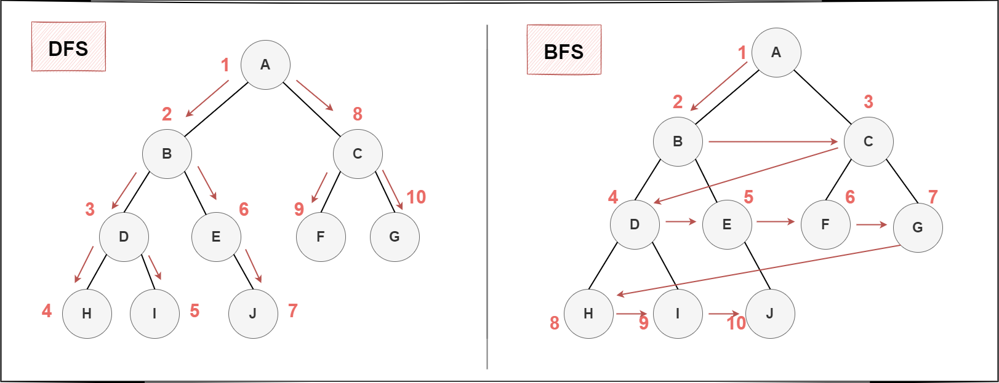
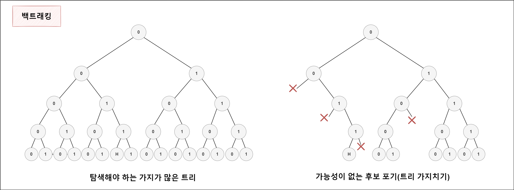
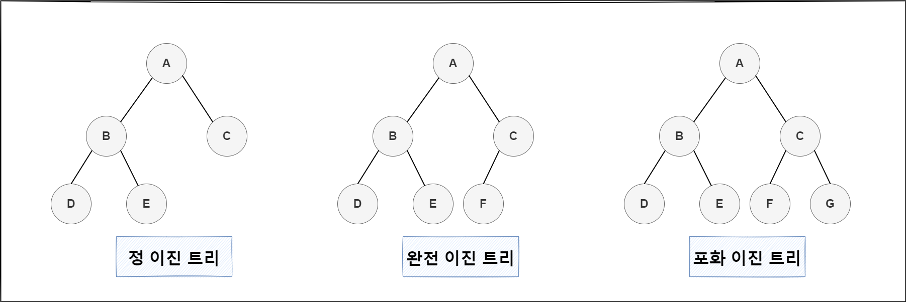
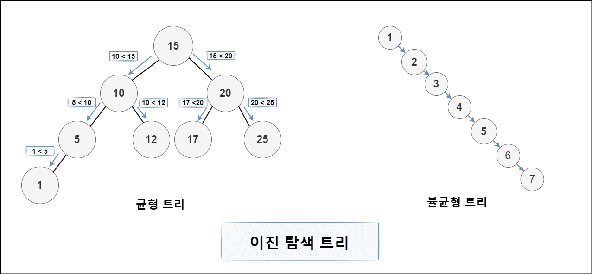
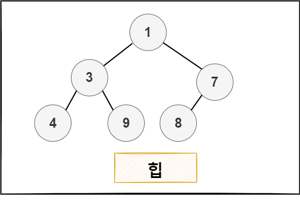
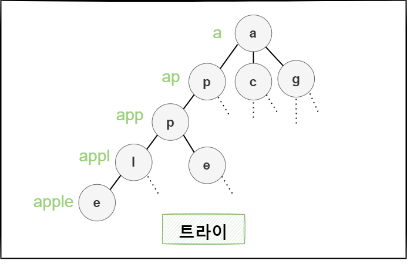

## 비선형 자료구조

데이터 요소가 순차적으로 배열되지 않는 자료구조를 비선형 자료구조 라고 한다. 탐색이 복잡하고 선형에 비해 구현하기도 다소 번잡하지만 메모리를 좀 더 효율적으로 사용할 수 있다는 장점이 있다. 대표적으로 그래프를 예로 들 수 있다.

그래프란 객체의 일부 쌍 pair들이 ‘연관되어’ 있는 객체 집합구조를 말한다 .

- 오일러 경로 : 모든 간선을 한번씩 방문하는 유한그래프

  - 모든 정점이 짝수 개의 차수를 갖는 다면 성립
  - 간선을 기준으로 한다.

* 해밀턴 경로 : 각 정점을 한 번씩 방문하는 무향 또는 유향 그래프 경로

  - 최적알고리즘 이없는 대표적인 NP-complete(완전) 문제
  - 다시 출발점으로 돌아오는 경로 해밀턴 순환이라고 부른다.
  - 정점을 기준으로 한다

## 1. 그래프 순회

- 그래프 탐색이라고도 불리며 그 그래프의 정점을 방문 하는 과정을 말한다.
- 깊이우선탐색 DFS(Depth First Serch)와 너비우선탐색 BFS(Breadth-Firrst-Serch)이 있다.

### DFS

현재 자신의 위치에서 갈 수 있는 여러개의 노드 중 하나의 노드를 탐색하면서 더 이상 갈 수 있는 노드가 없을 때 까지 해당 노드를 타고 들어가 깊게 탐색한다.

- 스택이나 재귀로 구현한다.
- 백트레킹을 통해 뛰어냔 효용 보인다

### BFS

가장 가까운 곳들을 먼저 탐색하고, 멀리 떨어져 있는 노드를 나중에 탐색하는 방법이다. 현재 자신의 위치에서 갈 수 있는 모든 노드를 한번씩 탐색한 뒤 다시 연결되어 있는 모든 길을 넓게 탐색한다.

- 주로 큐로 구현한다.
- 그래프의 최단경로를 구하는 문제나 무한한 경로 탐색 등에 사용 된다 .
- 재귀로 동작하지 않는다.

### 백트래킹

- 해결책에 대한 후보를 구축해 나가아가 가능성이 없다고 판단되는 즉시 후보를 포기(백트레킹,Backtrack)해 정답을 찾아가는 법용적인 알고리즘으로 제약충족문제에 특히 유용하다.
- DFS 는 백트레킹의 골격을 이룬다. 백트레킹은 주로 재귀로 구현한다.
- 가보고 되돌아오고를 반복하기 때문에 최악의 경우는 모든 경우를 다 거친다음에 도착할 수 있다. 자칫 브루트 포스와 유사하지만 한번 방문 후 가능성 없는 경우 즉시 후보를 포기한다는 점에서 매번 같은 경로 방문하는 브루트 포스 보다는 우아하다.
- 트리의 불필요한 부분을 버리는 것을 트리 가지치기(pruning) 한다고 한다.

> <i class="fa fa-info-circle" aria-hidden="true"></i> 제약 충족 문제
>
> - 제약 충족 문제란 수많은 제약조건을 충족하는 상태를 찾아내는 수학문제를 말한다
> - 백트레킹은 제약충족문제를 풀이하는데 필수적인 알고리즘이다. 가지치기를 통해 제약 충족 문제를 최적화 하기 때문이다.

## 2. 트리

- 트리는 재귀로 정의된 자기 참조 자료구조이다. 루트 값과 부모-자식관계의 서브트리로 구성되며 서로 연결된 노드의 집합이다.

* 그래프와 트리의 차이점은? 트리는 순환 구조를 갖지 않는 그래프이다. 그래프는 단방향이 될수도 양방향이 될 수도 있지만 트리는 부모노드에서 자식노드를 가르키는 단방향뿐이다. 또한 트리는 하나의 부모노드를 가지고 있으며 루트 또한 하나여야한디.

### 이진 트리

트리가 m개 이하 자식노드 가지고 있으면 m-ary트리(다항트리)라고 한다. 이때 m=2인 경우, 모든 노드의 차수가 2 이하 일때는 이진 트리라고 부른다. 아래는 이진트리의 타입이다.

- 정 이진 트리(Full Binary Tree) : 모든 노드가 0개 또는 2개의 자식노드를 갖는다.
- 완전 이진 트리(Complate Binary Tree) : 마지막 레벨을 제외하고 모든 레벨이 완전히 채워져 있으면 마지막 레벨의 모든 노드트 가장 왼쪽부터 채워져 있다.
- 포화 이진 트리(Perfect Binary Tree) : 모든 노드가 2개의 자식 노드를 갖고 있으며, 모든 리프 노드가 동일한 깊이를 갖는다.

### 이진 탐색 트리(BST)

앞서 말한 이진 트리는 정렬 여부와 관계 없이 모든 노드가 둘 이하의 자식을 갖는 단순한 트리형태였다.
이진 탐색 트리(Binary Search Tree)란 정렬된 트리를 말한다. 이진 탐색 트리는 노드의 왼쪽 서브트리에는 그 노드의 값보다 작은 값들을 지닌 노드들로 이뤄져 있고 오른쪽 서브트리에는 그 노드의 값과 같거나 큰 값들로 이루어져있다.
이 트리는 놀랍게도 탐색시 시간 복잡도가 O(log n)이다.
이진 탐색 트리는 로그의 강력함을 잘 표현한다.

아래 그림처럼 운이 나쁘게 비효율적으로 구성된 이진 탐색 트리는 전혀 효율적이지 않다. 검색시 O(n)의 시간이 걸리면서 연결리스트와 다르지 않아진다. 이런 트리는 균형을 맞춰줄 필요가 있다. 이를 위해 고안해 낸게 자가 균형 이진 탐색 트리(Self Balancing Search Tree)이다. 대표적으로 레드-블랙 트리가 있다.  

## 3. 힙

- 힙의 특성(최소 힙 에서는 부모가 항상 자식보다 작거나 같다)를 만족하는 거의 완전한 트리인 특수한 트리기반의 자료구조 이다.
- **힙은 정렬된 자료구조가 아니다.** 부모노드가 항상 자식보다 작다는 조건만 만족할 뿐이다. 부모-자식간의 관계만 정렬하고 좌-우 간의 관계는 정렬되어있지 않다.
- 우선순위 큐에서 가장 작은 값을 가져오는 것은 매번 힙의 루트를 가져오는 형태로 가져온다(최소 힙의 경우)
  
  > <i class="fa fa-info-circle" aria-hidden="true"></i> 이진 힙 vs 이진 탐색 트리
  >
  > 이진 힙과 이진 탐색 트리는 헷갈릴 수 있다. 차이점을 정리하면 다음과 같다.
  >
  > - 힙은 상/하 관계를 보장하며 BST는 좌/우 관계를 보장한다.
  > - 힙(최소 힙 기준)은 언제나 부모가 자식보다 작다. BST는 부모가 왼쪽자식보다는 크며 오른쪽 자식보다는 작거나 같다.
  > - BST는 탐색과 삽입이 모두 O(log n)에 가능하며 모든 값이 정렬되어야 할 때 사용한다.
  >   힙은 가장 큰 값을 추출하거나 가장 작은 값을 추출하려 할 때 사용한다. 힙은 이 작업이 O(1)이다.  
  >   (추출 후 재정렬은 O(log n))
  >   :::

## 트라이

- 검색 트리의 일종으로 일반적으로 키가 문자열인 동적 배열 또는 연관 배열을 저장하는데 사용되는 정렬된 자료구조다.
- 자연어 처리 분야에서 문자열 탐색을 위한 자료구조로 널리쓰인다.
- 각각의 문자단위로 색인을 구축한 것과 비슷한데, 단어 apple을 찾는 다면 5번 만에 문자열의 존재여부 파악이 가능하다.
  

## Reference

파이썬 알고리즘 인터뷰(책만)
